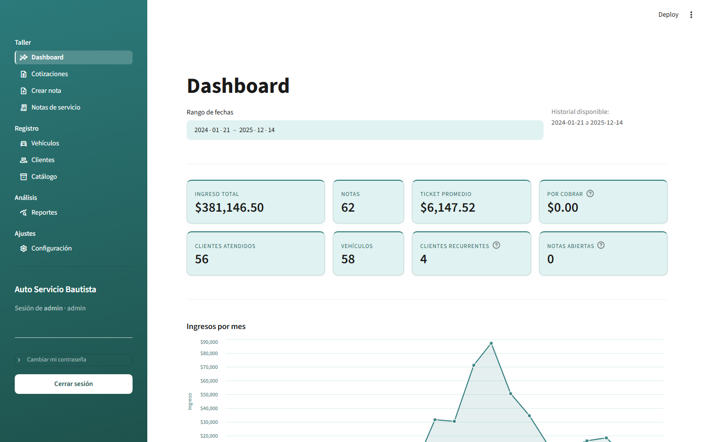
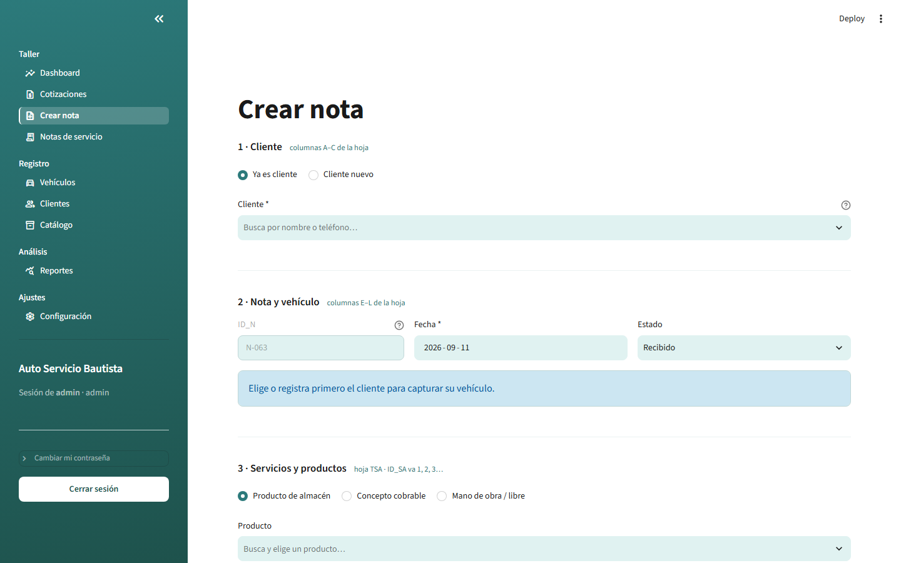
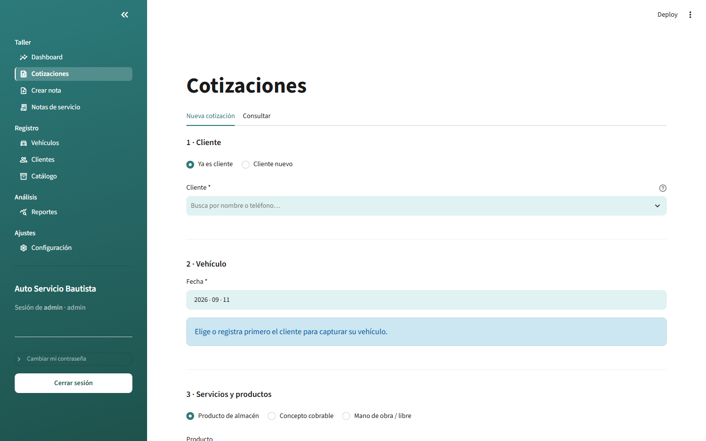

# Servicio Bautista — App de administración del taller


Aplicación en Streamlit para administrar el taller: clientes, catálogo de
conceptos, notas de servicio, cotizaciones y un tablero con el histórico. Los
datos viven en SQLite (`taller.db`); el Excel original es únicamente la carga
inicial y la app nunca lo escribe.

Construida a la medida de un taller mecánico real, para reemplazar 62 notas de
servicio y 58 clientes que hasta entonces vivían en una hoja de Excel — sin
perder ni un peso del histórico ($381,146.50 exactos) ni la trazabilidad de
las notas en papel que el taller sigue archivando. El razonamiento técnico
completo, decisión por decisión, está en [`ARCHITECTURE.md`](ARCHITECTURE.md).

## Capturas



| Crear nota | Cotizaciones |
|---|---|
|  |  |

## En pocas palabras

- **268 pruebas automatizadas** en tres suites independientes — esquema, capa
  de datos y pantallas — corriendo sobre bases temporales, nunca sobre los
  datos reales del taller.
- **La orden de trabajo se imprime con Chromium sin cabeza**, no con una
  librería de PDF de Python, para reproducir al pixel un diseño HTML/CSS con
  flexbox, grid y tipografías propias.
- **El dinero se guarda en centavos como entero**, nunca en punto flotante,
  para que el histórico cuadre exactamente al peso.
- **Los totales los recalculan triggers de SQLite**, no la aplicación: no
  pueden desincronizarse ni editando la base por fuera de la app.

## Qué hace

- **Dashboard** — ingresos por mes, KPIs, ingresos por categoría, mix
  Producto/Servicio, marcas más atendidas y top de clientes. Un solo filtro de
  fechas gobierna todo el tablero.
- **Cotizaciones** — el mismo formulario que «Crear nota» (cliente, vehículo,
  partidas, IVA), pero sin folio de servicio: es un presupuesto, no un trabajo
  realizado, así que no cuenta en el dashboard ni en los reportes. El cliente y
  el vehículo sí quedan registrados; cuando el cliente acepta, se convierte en
  nota real con un clic, sin volver a capturar nada.
- **Crear nota / Notas de servicio** — capturar una nota nueva (cliente,
  vehículo y partidas desde el catálogo o como concepto libre), consultarla con
  su detalle, **editarla** (cabecera, cantidades, precios, agregar y quitar
  renglones), **eliminarla** y **descargar la orden de trabajo en PDF**, con el
  diseño del taller, lista para imprimir o mandar al cliente.
- **Diagnósticos con escáner** — el reporte de códigos de falla (DTC) que hoy
  se entrega en papel: mismo cliente y vehículo que una nota, la lista de
  códigos agrupada por sistema (con su gravedad) y el resumen y
  recomendaciones, capturados a mano tras leer el escáner, y **descargables en
  PDF** con el mismo diseño del taller.
- **Clientes** — alta con aviso de nombre duplicado, búsqueda que ignora
  acentos y mayúsculas, y edición.
- **Catálogo** — alta, edición, búsqueda, filtros por tipo y categoría, y
  activar/desactivar conceptos.

## Instalación

Requiere Python 3.12. En Windows el comando `python` choca con el acceso directo
de Microsoft Store, así que se usa el lanzador `py`:

```powershell
py -3.12 -m venv .venv
.venv\Scripts\python.exe -m pip install -r requirements.txt
.venv\Scripts\python.exe -m playwright install chromium
```

El último paso baja el navegador que imprime la orden de trabajo. Son unos
150 MB y solo se descarga una vez.

**Tipografía de la orden impresa.** La plantilla usa *Archivo*. Si los archivos
no están, cae a una tipografía de reserva y la hoja se ve bien igual, pero para
que salga exacta hay que bajar los `.woff2` de
[Google Fonts](https://fonts.google.com/specimen/Archivo) y ponerlos en
`Plantillas/Work_order/export/fonts/` con estos nombres:
`Archivo-Regular.woff2`, `Archivo-Medium.woff2`, `Archivo-SemiBold.woff2` y
`Archivo-Bold.woff2`. En cuanto aparecen se usan solas, sin tocar código.

## Puesta en marcha

**1. Cargar el histórico** (una sola vez):

```powershell
.venv\Scripts\python.exe cargar_datos.py
```

Crea `taller.db`, migra el Excel, deriva el catálogo y crea el usuario
administrador. **Anota las credenciales que imprime al final: la contraseña no
se vuelve a mostrar.** Al terminar valida que la suma del histórico cuadre.

El script es idempotente: correrlo de nuevo no duplica ni pisa nada, solo agrega
lo que falte. Para reimportar desde cero (borra el histórico, conserva los
usuarios):

```powershell
.venv\Scripts\python.exe cargar_datos.py --reiniciar
```

**Si clonaste este repositorio**, el Excel del taller no viene incluido: trae
nombres y teléfonos de clientes reales y no se publica. En su lugar hay
`ejemplo_taller.xlsx`, con la misma estructura y datos inventados, que el
cargador encuentra solo. Lo regeneras con:

```powershell
.venv\Scripts\python.exe generar_ejemplo.py
```

**2. Levantar la app**:

```powershell
.venv\Scripts\streamlit.exe run app.py
```

Abre <http://localhost:8501> y entra con las credenciales del paso anterior.
Cambia la contraseña desde la barra lateral.

## Análisis

Scripts independientes de la app. Guardan CSV y PNG en `analisis/salidas/`
(carpeta ignorada por git: se regenera corriéndolos).

```powershell
.venv\Scripts\python.exe analisis\estacionalidad.py
.venv\Scripts\python.exe analisis\rentabilidad_categorias.py
.venv\Scripts\python.exe analisis\retorno_clientes.py
.venv\Scripts\python.exe analisis\ticket_por_marca.py
```

Cada uno avisa cuando los datos no alcanzan para sostener una conclusión — por
ejemplo, que con 4 clientes recurrentes no se puede calcular una tasa de retorno
confiable, o que sin datos de costo se está midiendo facturación y no
rentabilidad.

## Pruebas

```powershell
.venv\Scripts\python.exe pruebas_esquema.py   # 37 — garantías de la base
.venv\Scripts\python.exe pruebas_datos.py     # 118 — capa de acceso a datos
.venv\Scripts\python.exe pruebas_app.py       # 62 — pantallas, con AppTest
```

Las dos primeras corren sobre una base temporal y no tocan `taller.db`.

## Estructura

```
app.py                  Entrada de Streamlit: login y navegación
db.py                   Capa de acceso a datos — todo el SQL vive aquí
auth.py                 Hash y verificación de contraseñas
nota_pdf.py             Genera la nota de servicio imprimible en PDF
exportar.py             Vuelca la base a CSV, Excel, SQL y al formato de la hoja del taller
styles.py               Paleta y hoja de estilo de toda la interfaz
esquema.sql             Definición de la base
cargar_datos.py         Carga inicial desde el Excel (idempotente)
generar_ejemplo.py      Genera ejemplo_taller.xlsx con datos inventados
restablecer_clave.py    Restablece la contraseña de un usuario desde la terminal
paginas/                Una pantalla por módulo
paginas/descargas.py    Envoltorios cacheados de los archivos descargables
analisis/               Scripts de análisis, independientes de la app
historico/              Migraciones ya aplicadas; no hace falta correrlas
explorar_excel.py       Inspección del Excel de origen (Paso 0)
verificar_datos.py      Verificación de integridad del Excel (Paso 0)
pruebas_*.py            Suites de pruebas
```

## Decisiones de diseño

**El dinero se guarda en centavos como entero.** La especificación exige que el
histórico sume exactamente $381,146.50, y las sumas en punto flotante se
desvían. Con enteros la aritmética es exacta y el `CHECK` de
`total = cantidad × precio` no necesita tolerancias. Las columnas se llaman
`_centavos` para que nadie las confunda con pesos; `db.py` es la única frontera
donde se convierte.

**Las PKs originales se conservan.** `id_cliente` sigue siendo el consecutivo de
llegada al taller (1–62, con huecos) e `id_nota` mantiene el formato `N-001`.
Reasignarlas rompería la trazabilidad con las notas en papel. La única que se
regenera es la de partidas: el `ID_SA` del Excel era un contador global con 23
nulos y sin significado. En su lugar hay un `id_partida` autoincremental y una
columna `linea` con el consecutivo 1..n *dentro* de cada nota, que es lo que se
imprime. Al quitar un renglón las líneas se renumeran para que la nota impresa
nunca salga con «1, 2, 4, 5» y parezca que falta algo; se hace en dos pasos
porque `UNIQUE (id_nota, linea)` se valida fila por fila y una reasignación
directa chocaría a media operación.

**El histórico es inmutable.** Cada partida guarda su propia copia de la
descripción, la categoría y el precio con que se cobró, además del FK opcional
al catálogo. Por eso cambiar un precio del catálogo no altera ninguna nota
pasada — hay una prueba que lo verifica.

**La mano de obra no está en el catálogo.** Cruza 8 categorías con precios de
$150 a $8,490, así que un precio de catálogo no significaría nada. Se captura
como concepto libre con precio manual en cada nota. Sacarla resolvió además toda
la ambigüedad del catálogo: sin ella ningún concepto cruza categorías, y con la
llave `(descripción, tipo)` quedan 90 conceptos limpios.

**Los totales los mantienen triggers, no la app.** `notas.total_centavos` se
recalcula en la base con cada INSERT, UPDATE y DELETE de partidas. Así la
igualdad que la especificación marca como obligatoria no puede desincronizarse,
ni aunque alguien modifique la base por fuera de Streamlit.

**Un `CHECK` codifica una regla real del taller:** un concepto de tipo Servicio
siempre lleva acción y un Producto nunca. Se verificó en las 246 filas del
histórico sin una sola excepción.

**Contraseñas con PBKDF2-HMAC-SHA256**, 600,000 iteraciones y salt único por
usuario. Se eligió sobre bcrypt porque es librería estándar y no requiere
compilar nada en Windows.

**Nomenclatura del vehículo: Marca, Año y Tipo.** La interfaz y la orden
impresa usan «Tipo» para el modelo específico de esa marca (p. ej. Chevrolet
Malibú) y «Año» para el año, siguiendo la forma en que el taller ya llena su
información. La columna interna de la base se sigue llamando `modelo` — es un
detalle de implementación que no cambia nada visible, y renombrarla habría
significado tocar el esquema, las migraciones y todo `db.py` sin ganar nada
para el usuario.

**Cotizaciones vive en tablas separadas de notas.** Un presupuesto usa
`cotizaciones` / `cotizacion_partidas`, con sus propios triggers de subtotal e
IVA, en vez de una nota con una bandera "es cotización". Así una cotización
jamás puede colarse en el dashboard ni en los reportes de facturación por un
filtro que alguien olvidó agregar. El cliente y el vehículo sí se guardan en
sus tablas normales — es lo que permite que, al convertirla, «Crear nota» ya
los tenga en sus listas. `eliminar_nota` revierte a Pendiente cualquier
cotización que apunte a la nota borrada, en vez de bloquear el borrado o dejar
una referencia rota.

**La base vive en `D:\TallerBautista\taller.db`, fuera de la carpeta del
proyecto.** Antes estaba junto al código en C:, hasta que ese disco se quedó
con apenas 115 MB libres y una escritura falló a medio guardar una nota. La
ruta está fija en `db.RUTA_DB` (`db.py`); si el proyecto corre en otra máquina
sin disco D:, hay que ajustar esa línea a mano — se prefirió así, explícito y
simple, a leer una variable de entorno para una sola computadora. La carpeta
se crea sola la primera vez que algo escribe en la base.

## Seguridad

`.streamlit/config.toml` tiene `address = "0.0.0.0"`: el servidor escucha en
toda interfaz de red, para poder entrar desde un celular o una tablet en el
mismo Wi-Fi del taller (`http://<IP local de la computadora>:8501`). Sigue
siendo HTTP sin cifrar, así que esto vale **solo dentro de la red del
taller** — nunca abrir el puerto hacia internet (por ejemplo con
port-forwarding en el router), porque los datos de clientes y el login
viajarían sin cifrar a la vista de cualquiera. Si el taller alguna vez no
necesita el acceso por Wi-Fi, lo más seguro es volver `address` a
`"localhost"`.

`taller.db` está en el `.gitignore` y además vive fuera de la carpeta del
proyecto (ver la siguiente sección): contiene datos de clientes y hashes de
contraseñas, y no debe subirse a ningún repositorio.

## Notas sobre los datos

Detectados al inspeccionar el Excel y respetados en la carga:

- La hoja `TC_TA` contiene **dos tablas lado a lado** separadas por una columna
  vacía. Leerla como una sola es un error; el cargador detecta los bloques.
- El teléfono se lee como número y debe guardarse como texto. 16 de 58 clientes
  no tienen.
- La columna `Tipo` de las notas es en realidad el **modelo** del vehículo. Se
  renombró a `modelo` y se guarda como texto: hay un Chrysler **300** que como
  número se volvería `300.0`.
- Hay 3 nombres de cliente y 4 descripciones con espacios sobrantes; se limpian
  al cargar.
- 2 clientes registrados nunca han traído vehículo, así que el KPI de "clientes
  atendidos" da 56 y no 58.
- El histórico tiene **11 meses de 2024 sin una sola nota**. El registro se
  vuelve continuo hasta diciembre de 2024. El dashboard dibuja esos meses en
  cero en vez de interpolarlos, para no inventar un crecimiento que no existió.
